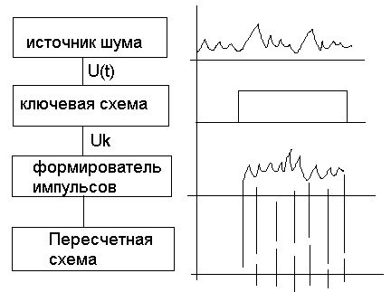

# Лекция 10 (07.11.2022)
## Методы получения последовательности случайных чисел.

При имитационном моделировании сложных систем одним из основных вопросов является учет стохастических воздействий. Для этого метода характерно большое число операций со случайными числами и зависимость результатов от качества исходных последовательностей случайных чисел.
1.	Аппаратный (физический) - случайные числа вырабатываются специальной электронной приставкой (генератор случайных чисел - внешнее устройство)
2.	Табличный (файловый)
3.	Алгоритмический (программный)

### Аппаратный способ.
Представляет из себя шум.

### Табличная схема.
Случайные числа оформляются в виде таблицы и помещаются во внешнюю или оперативную память.

### Алгоритмический способ.
Способ основан на формировании случайных чисел с помощью специальных алгоритмов.

## Преимущества и недостатки типов генерации случайных чисел.
|Способ|Достоинства|Недостатки|
|------|-----------|----------|
|Аппаратный| 1.	Запас чисел неограничен   2.	Расходуется мало операций   3.	Не занимается место в оперативной памяти. | 1.	Требуется периодическая проверка на случайность   2.	Нельзя воспроизводить последовательности   3.	Используются специальные устройства. Надо стабилизировать |
|Табличный | 1.	Требуется однократная проверка   2.	Можно воспроизводить последовательности | 1.	Запас чисел ограничен   2.	Занимает место в оперативной памяти и требуется время на обращение к памяти |
|Алгоритмический |	1.	Однократная проверка   2.	Можно многократно воспроизводить последовательности чисел   3.	Относительно малое место в оперативной памяти   4.	Не используются внешние устройства | 1.	Запас чисел последовательности ограничен её периодом   2.	Требуются затраты машинного времени |
