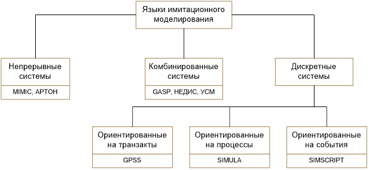
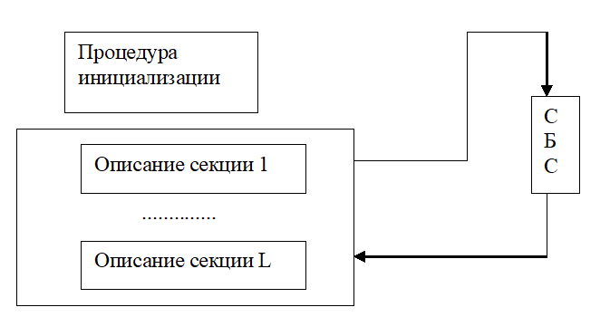
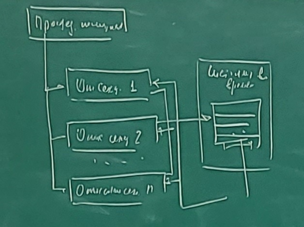
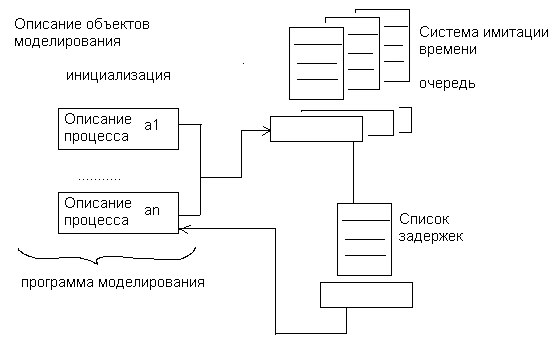
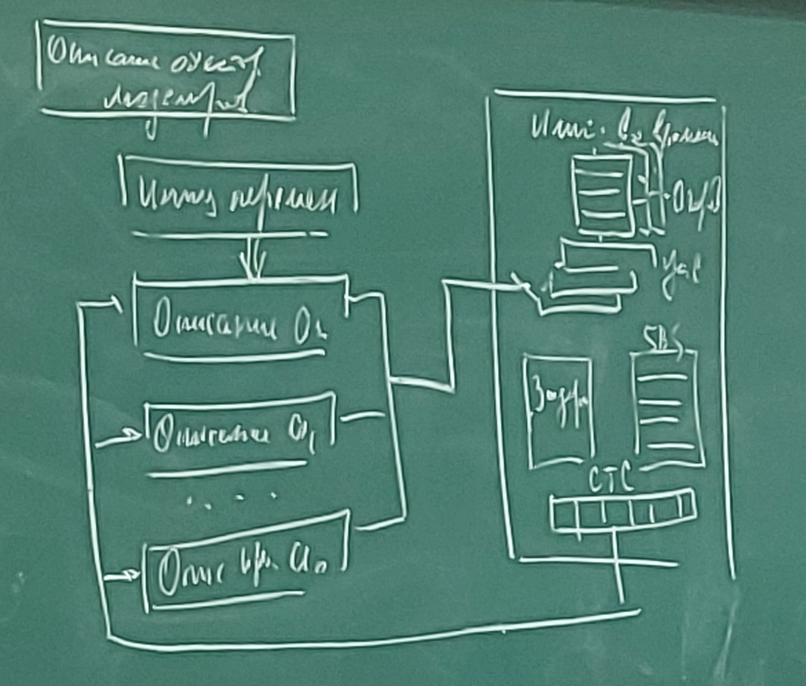
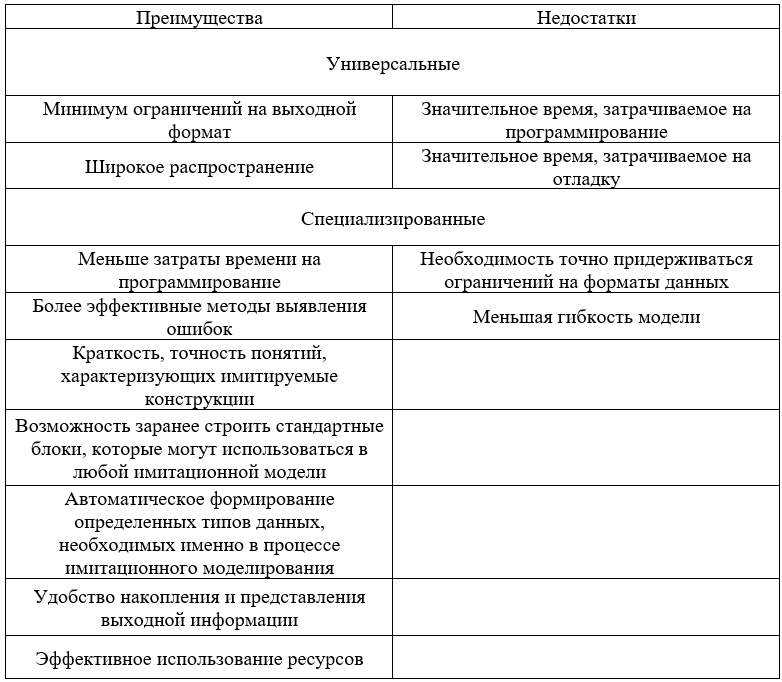

# Лекция 13 (28.11.2022)
## Моделирование систем и языки моделирования.
Алгоритмические языки при моделировании систем служат вспомогательным аппаратом в разработке машинной реализации и анализа характеристик моделей.

*Основная задача* – это выбор языка.

Каждый язык имеет свою систему абстракций, позволяющих реализовать формальную модель системы.

Качество языков моделирования характеризуется:
1. Удобством описания процесса функционирования;
2. Удобством ввода исходных данных, варьирования структуры, алгоритмов разработки и параметров модели;
3. Эффективностью анализа и вывода результатов моделирования;
4. Простотой отладки и контроля работы моделирующей программы;
5. Доступностью восприятия и использования языка.

Все современные языки программирования определяют поведение систем во времени (событийный алгоритм и его модификации)

(В большинстве своем языки моделирования определяют поведение систем во времени с помощью модифицированного событийного алгоритма. Как правило, он включает в себя список текущих и будущих событий.)

### ***Классификация языков имитационного моделирования.***
Основа классификации – принцип формирования системного времени. 

Непрерывное представление систем сводится к представлению дифференциальных уравнений, с помощью которых устанавливается связь вход-выход. Если выходные переменные модели принимают дискретные значения, то уравнения являются разностными.

Предполагается, что в системе могут наступать события двух типов:
* события, зависящие от состояния;
* события, зависящие от времени.

Состояние системы описывается набором переменных, причем некоторые из них меняются непрерывно. При таком подходе пользователь должен использовать функции, описывающие условия наступления событий. Обязательно нужно описать: законы изменения непрерывных переменных, правила перехода от одного состояния к другому, т.е. реализуется классический принцип ДУ (дифференциальные уравнения).

### ***Формальное описание динамики моделируемого объекта.***
Будем считать, что любая работа в системе совершается путем выполнения ***активностей***. Т.е. активность является наименьшей единицей работы. Именно её рассматривают как единый дискретный шаг. Она имеет свое время выполнения. Следовательно, активность является, единым динамическим объектом, указывающим на совершение единицы работ.

***Процесс*** – это логически связанный набор активностей.

Пример (Считывание информации с жесткого диска): активность установки головки жесткого диска, активность ожидания запроса к диску, активность передачи информации с жесткого диска.

Активность проявляется в результате совершения событий.

**События** – это мгновенное изменение состояния некоторого объекта системы.

Рассмотренные объекты (активности, процессы, события) являются <u>*конструктивными элементам*</u> для динамического поведения системы. На их основе строятся языки моделирования. В то время, когда динамическое поведение системы формируется в результате выполнения большого числа взаимодействующих процессов, сами эти процессы образуют относительно небольшое число классов. Следовательно: чтобы описать поведение сложной системы, достаточно описать поведение каждого класса процессов и задать значение атрибутов для конкретных процессов. (т.е. выбрать параметрическую модель)

### **Задачи построения модели.**
Построение модели состоит из решения двух основных задач:
1.	Первая задача сводится к тому, чтобы описать правила, задающие виды процессов, происходящих в системе.
2.	Указать значения атрибутов таких процессов. Или сгенерировать. При этом система описывается на определенном уровне детализации в терминах множества описаний процессов, каждый из которых включает множество правил и условий возбуждения активности. Такое описание системы может быть декомпозировано. Именно такой подход обеспечивает многоуровневое исследование системы.\
(Вторая задача заключается в том, чтобы описать правила задания атрибутов или задать правила генерации этих значений. При этом система определяется на конкретном уровне детализации в терминах множества описаний процессов, каждый из которых в свою очередь включает множество правил и условий возбуждений активности. Такое описание системы может быть детализировано на более подробном или более иерархическом уровне представления с помощью декомпозиции процессов (в идеальном случае в активности). Это обеспечивает многоуровневое исследование системы.)

Т.к. модель в общем случае служит для описания временнОго поведения системы, то язык моделирования должен обладать средствами, отображения времени.

### ***Языки, ориентированные на события.*** 
Моделирующая программа организованна в совокупности в виде секций событий (процедуры отражающие события). Процедура (секция) состоит из набора операций, которые в общем случае выполняются после выполнения какой-либо активности. Выполнение функций синхронизировано списком будущих событий.

Структуру рассмотрим на примере языка SIMSCRIPT.

Первичное описание - это описание секций событий.

### ***Языки, ориентированные на процессы.***
Моделирующая программа организуется в виде набора описаний процесса. Каждый из которых описывает один класс. Описание процесса функционирования устанавливает атрибуты и активности всех процессов. Синхронизация операций во времени (языка ориентированного на процессы) реализуются так же с помощью списка будущих событий, который содержит точку возобновления конкретного процесса (точка прерывания).

На примере языка SIMULA:

Результаты экспертных оценок сравнения различных языков при моделировании большого класса систем.
Критерии:
1.	<u>*Возможность языка.*</u> Выше всех находится SIMULA -> SIMSCRIPT -> GPSS -> C -> PYTHON
2.	<u>*Простота применения:*</u> GPSS -> SIMSCRIPT -> SIMULA -> PYTHON -> C
3.	<u>*Предпочтение пользователей:*</u> SIMSCRIPT -> GPSS -> SIMULA -> PYTHON -> C

### ***Сравнение универсальных и специализированных языков программирования при моделировании:***

### ***Возможности ... моделирования***
**Первое** Анимация и динамическая графика. Анимацию используют для представления сути имитационной модели (для руководителя). Анимация нужна с целью отладки существующей программы. Можно показать что имитационная модель неправильная.

Существует два главных типа анимации:
1. Совместная анимация (осуществляется в процессе имитационного моделирования).
2. Раздельная анимация (сохраняем данные в файле ...)

**Второе** Статистический. Объектно-ориентированное моделирование.

В чем недостатки такого подхода? (Невозможно объяснить что такое инкапсуляция? Необходим опыт работы с ООП...)

## Концептуальная модель (ЛР5)
В информационный центр приходят клиенты через интервалы времени 10+-2 минуты. Если все три, имеющихся оператора, заняты, клиенту отказывают в обслуживании. Операторы имеют разную производительность. И могут обеспечивать обслуживание среднего запроса за 20+-5, 40+-10, 40+-20 минут. Клиенты стремятся занять свободного оператора с максимальной производительностью. Полученные запросы сдаются в приемные накопители, откуда они выбираются для обработки. На 1ый компьютер запросы от 2ого и 1ого оператора. На 2ой компьютер от 3его оператора. Время обработки на 1ом и 2ом компьютере равны соответственно 15 и 30 минутам. 

Смоделировать процесс обработки трехсот (300) запросов (которые пришли).

В результате должны определить вероятность отказа.

Необходимо:

**Первое:** Построить структурную схему модели. (рисуем 1, 2, 3 оператор, 2 накопителя и 2 компьютера, всё...) На входе клиенты на выходе результаты.

Возможны:
1. режим нормального обслуживания (Когда клиент выбирает одного из свободных операторов, но предпочитает у кого меньше очередь???)
2. режим отказа?

**Второе:** Структурная схема модели (каналы и накопители) 3 канала...

Эндогенные переменны - время обработки заданий i-ым оператором (их всего три) и время решения задания на j-ом компьютере (их всего два).

Экзогенные племенные - n0 - число обслуженных клиентов, n1 - число клиентов получивших отказ..

Уравнения модели - вер-ть= n1/(n0+n1)

P.S. за единицу дискретного времени выбрать 1 сотую минуты (0.01 [мин])

Срок сдачи пятница до 23:59

