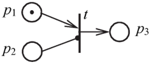
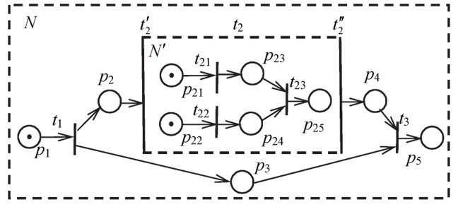
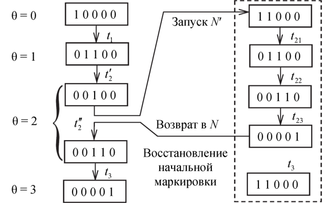

# Лекция 15 (12.12.2022)
## Основные свойства сети Петри

https://studref.com/702179/informatika/osnovnye_svoystva_setey_petri

1. Свойство ограниченности – позиция в сети называется ограниченной, если для любой достижимой в сети маркировки существует такое $k$, что маркировка $\mu \le k$, то есть сеть называется ограниченной, если все ее позиции ограниченные (сеть, которую мы рассматривали на предыдущем рисунке, неограниченная).
2. Свойств безопасности – в безопасной сети вектор маркировок состоит только из нулей и единиц, то есть является двоичным
3. Свойство консервативности – сеть называется консервативной, если сумма фишек во всех позициях остается постоянной при работе с ней, то есть сумма по всем тау для данной сети остается постоянной.
4. Свойство живости – переход называется потенциально живым, если в начальной маркировки существует некая маркировка, при которой переход может сработать. Если переход является потенциально живым для любой достижимой в сети маркировки, то он называется живым. Если не является – то называем мертвым, маркировка в этом случае будет называться тупиковой. То есть при тупиковой маркировки не может сработать ни один переход. На дереве маркировок тупиковая маркировка является листом.

Переход называется устойчивым, если никакой другой переход не может лишить его возможности сработать при наличии для этого необходимых условий.

https://studref.com/702180/informatika/nekotorye_obobscheniya_setey_petri

### **Ингибиторные сети** (ИСП, IPN)
Это сети Петри, для которых функция инцидентности имеет вид $F = F^P \cup F^t \cup F^I,$ т. е. она дополнена специальной функцией инцидентности $F^I: Р \times Т \to \{0, 1\}$, которая вводит ***ингибиторные дуги*** для тех пар $(p_i t_j)$, для которых $f^I_{ij} = 1$. Ингибиторные дуги связывают только позиции с переходами, эти дуги на рисунках заканчиваются не стрелками, а кружочками (рис. 5.3). Кратность этих дуг всегда равна 1.

Правила срабатывания переходов в ингибиторной сети модифицируются следующим образом. Переход $t_j$ может сработать при маркировке М, если для всех связанных с ним позиций $p_i$ и $p_k$

$\Large (\mu_i \ge f_{ij}^p) \wedge (\mu_k \cdot f_{kj}^I=0),$

т. е. по сравнению с условием (5.6) введено дополнительное условие: позиция $p_k$, соединенная с переходом $t_j$ ингибиторной дугой, не должна содержать фишек (должна иметь нулевую маркировку). Так, переход $t$ на рис. 5.3 может срабатывать только при $\mu_1 > 0$ и $\mu_2 = 0$.

### **Сети с приоритетами**
При определении сети Петри отмечалась недетерминированность ее работы: если имеется возможность срабатывания нескольких переходов, то срабатывает любой из них. При моделировании реальных систем могут сложиться ситуации, когда последовательность срабатываний необходимо регламентировать. Это можно сделать, введя множество приоритетов $PR: Т \to \{0, 1, ...\}$ и приписав каждому из переходов $t_j$ соответствующее целочисленное значение приоритета $pr_j$. Тогда правило срабатывания переходов модифицируется: если на некотором такте работы сети $PN$ имеется возможность для срабатывания нескольких переходов, то срабатывает тот из них, который имеет наивысший приоритет. Так, из двух готовых к срабатыванию переходов $t_1$ и $t_2$ (рис. 5.4, а) первым должен сработать переход $t_2$, имеющий приоритет $pr_2 = 1$, поскольку приоритет перехода $t_1 рг_2 = 2$, т. е. ниже.

### **Сети со случайными срабатываниями переходов**
В описанной выше ситуации, когда имеется возможность срабатывания нескольких переходов $t_i, t_j ..., t_s$, их приоритет можно задавать вероятностями срабатывания каждого их переходов $p_i, р_j, ..., p_s$, причем $p_i + p_j + ... + p_s = 1$. Тогда исходная маркировка $М_0$ приведет на следующих шагах работы сети к набору маркировок $M_i, M_j, ..., M_S$, каждая из которых будет помечена соответствующей вероятностью. Отождествив маркировки с состоянием сети и предположив, что вероятности не зависят от работы сети в предыдущие такты, мы получим цепь Маркова, описывающую вероятностное поведение системы.

### **Иерархические сети**
Они сети представляют собой многоуровневые структуры, в которых выделяют сети различных уровней. (Они позволяют моделировать различные многоуровневые (иерархические) системы.)

В отличие от обыкновенных сетей Петри, в иерархических сетях имеются два типа переходов: простые и составные. Простые переходы ничем не отличаются от рассмотренных ранее. Составные переходы содержат внутри себя сеть Петри более низкого уровня. Формально они состоят из входного («головного») и выходного («хвостового») переходов, между ними находится внутрення сеть Петри, которая, в свою очередь, также может быть иерархической (вложенность не ограничена).

Пример иерархической сети N:

Здесь приведен пример иерархической сети который имеет составной переход $t_2$, содержащий внутри себя сеть $N'$ этот составной переход имеет голову ($t_2'$) и хвост ($t_2''$). Между ними заключена вся сеть. Она состоит из позиций $p_{21}, p_{25}$ и переходов $t_{21}, t_{23}$. Иерархическая сеть функционирует как обыкновенная сеть, переходя от одной маркировки к другой, обмениваясь фишками (в том числе между сетями различного уровня). Исключение составляют правила работы составных переходов.

Срабатывание составных переходов является не мгновенным событием, как в обыкновенных сетях Петри, а некоторым составным действием. Поэтому говорят не о срабатывании составного перехода, а о его работе. На каждом шаге дискретного времени $\theta$ составной переход может находиться в одном из двух состояний - пассивном и активном. Начальное состояние всех переходов - пассивное. Составной переход может быть активирован, в момент времени $\theta$, если до этого он был пассивен и имеются условия для срабатывания его головного перехода (задаваемые условиями 5.6). При этом производится изменение маркировки в сети верхнего уровня по известным нам правилам (5.7) и одновременно запускается работа в сети, находящейся внутри составного перехода. Во время ее работы функционирование сети верхнего уровня блокируется. Сеть нижнего уровня работает с учетом своей начальной маркировки до тех пор, пока все ее переходы не станут пассивными (т. е. не смогут сработать). После этого происходит срабатывание хвостового перехода и изменение маркировки сети верхнего уровня (согласно правилам 5.7). Составной переход возвращается в пассивное состояние, а в сети нижнего уровня восстанавливается начальная маркировка.

"На шаге $\theta = 2$ происходит работа составного перехода и сети $N'$ в следующем порядке: срабатывает $t_2'$, запуск сети $N'$, окончание работы $N'$, восстановление начальной маркировки, срабатывание $t_2$ и продолжение работы сети"

Описанный процесс напоминает выполнение подпрограммы при программировании, где срабатывание перехода $t'_2$ соответствует вызову подпрограммы, а $t''_2$ срабатывание - возврату в основную программу.

### Раскрашенные (цветные) сети
В ряде приложений перемещаемые в сети Петри ресурсы (фишки) требуется дифференцировать, и тогда приходится вводить фишки различных видов (например, разных цветов). В этом случае для каждого перехода необходимо указывать, при каких комбинациях фишек во входных позициях он может сработать и какое количество фишек различных цветов помещается в выходные позиции.

https://studfile.net/preview/9270086/page:16/

## Моделирование дискретных систем, формализованных сетей Петри
При описании сетей Петри выделяют два понятия: события и условия. 

***События*** - это действие в системе. В сетях Петри они моделируются переходами.

***Условие*** - предикат или логическое описание системы, принимающее значение «истина» или «ложь». Условия моделируются позициями и условиями на дугах. Различаются предусловия и постусловия.

***Предусловие*** - это условие до срабатывания перехода, ***постусловие*** - соответственно, условие после срабатывания перехода.

Если процесс в системе достаточно сложный, то его подсистемы можно представить в виде ***непримитивных событий***. (Показанный на рисунке 2.8 а составной переход $t_2$ непримитивное событие, моделируемое отдельной сетью Петри.)

Особенность Сети Петри – ***одновременность***. Если переходы $t_i$ и $t_j$ не влияют друг на друга, то в возможный словарь языка сети Петри входят как слова, начинающиеся с $t_i$ так и слова, начинающиеся с $t_j$.

Еще одна ситуация называется ***конфликтом***.

Переходы $t_i$, и $t_j$ находятся в конфликте, если запуск одного из них блокирует запуск другого (рис. 2.8 б).

### Простейшая система массового обслуживания.
Система имеет входной поток заданий (или заявок), и пока она занята выполнением очередного задания, она не может ввести следующее.

Рассмотрим множество условий и событий, характеризующих нашу СМО.

Условия:

$P_1$ - задание ждет обработки;

$Р_2$ - задание обрабатывается;

$Р_3$ - процессор свободен;

$Р_4$ - задание ожидает вывода.

 События (это действия):

$t_1$ - задание помещается во входную очередь;

$t_2$ - начало выполнения задания;

$t_3$ - конец выполнения задания;

$t_4$- задание выводится.

Сеть Петри, моделирующая рассматриваемую систему, показана на рисунке 2.9 б.

Поясним работу данной сети. Показанная на рисунке начальная маркировка $М_0 = [0,0,1,0]$ соответствует состоянию, когда система свободна и заявки на обслуживание отсутствуют. При срабатывании перехода $t_1$ (от внешнего источника) поступает задание и получается маркировка $М_1 = [1,0,1,0]$. При этом может сработать переход $t_2$, что означает начало обслуживания задания и приводит к маркировке $М_2 = [0,1,0,0]$. Затем может сработать переход $t_3$, что означает окончание обслуживания задания и освобождение системы, т.е. переход к маркировке $М_3 = [0,0,1,1]$. Переходы $t_1$ и $t_4$ могут работать независимо от $t_2$ и $t_3$, моделируя поступление и вывод заданий.

**Двухпоточная СМО.** Пусть теперь СМО выполняет задания, поступающие от двух источников и находящиеся в двух очередях. Вывод обработанных заданий осуществляется одним потоком. В этом случае модель системы имеет вид, показанный на рисунке 2.10.

Здесь введены дополнительные условия:

$Р_5$ - задание из второй очереди ждет обработки;\
$Р_6$ - задание из второй очереди обрабатывается.

Также введены дополнительные события:

$t_5$ - задание помещается во вторую очередь;\
$t_6$ - начало выполнения задания из второй очереди;\
$t_7$ - завершение выполнения задания из второй очереди.

# За то что нам засчитывают РК просто так
https://studfile.net/preview/9270086/page:16/

Дома решить следующую задачу: формализовать сети петри **конвейерную обработку**. Рассмотрим на примере сложения двух чисел с плавающей точкой.

Хотелось бы увидеть схему.