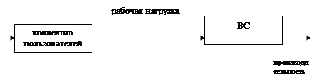
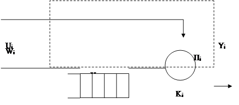
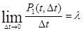

# Лекция 7 (17.10.2022)
https://smekni.com/a/122374-4/modelirovanie-sistem-massovogo-obsluzhivaniya-4/

https://studopedia.ru/21_22869_osnovnie-ponyatiya-teorii-massovogo-obsluzhivaniya.html
# Вычислительная система как объект моделирования
## Уровни проектирования
1. Структурный.
2. Функционально-логический уровень проектирования:
   - подуровни регистровых передач,
   - логический уровень.
3. Схемо-технический уровень.
4. Конструкторский.

## Моделирование на сисетмном коде уровне
При программировании новых и модернизации существующих вычислительных сиестем и сетей, необходимо предварительно оценивать их возможности по функционированию с учетом различных вариантов структурной организации. Эти варианты могут отличаться составом и характеристиками модулей структурой межмодульных связей, режимами работы, алгоритмами управления. Именно для оценок и используются модели вычислительных систем.

Под вычислительной системой будем понимать: комплекс аппаратных и программных средств, которые в совокупности выполняют определенные рабочие функции.

Операционная Система – набор ручных и автоматических процедур, которые позволяют группе людей эффективно использовать вычислительную установку.

Коллектив пользователей - это сообщество таких людей, которые использует нашу систему для удовлетворения нужд по обработке информации. (Входные сигналы - это программы, данные, команды, которые создаются коллективом пользователей, называется рабочей нагрузкой)

Индекс производительности – описатель, который используется для представления производительности системы. Различают количественные и качественные индексы производительности.

Качественные:
-  "легкость использования системы"
- мощность системы команд

Количественные:
- пропускная способность – объем информации, обрабатываемый в единицу времени.
- время ответа (реакции) – время между предъявлением системе входных данных и появлением соответствующей выходной информации.
- коэффициент использования оборудования – отношение времени использования указанной части оборудования в течение заданного интервала времени к длительности этого интервала.

Концептуальная модель ВС включает сведение о выходных и конструктивных параметрах системы, её структуре, особенностях работы каждого элемента и ресурса, постановка прикладных задач, определение цели моделирования.

Основные задачи:
1. Определение принципов организации ВС.
2. Выбор архитектуры, уточнение функций ВС и их разделение на подфункции, реализация аппаратным и программным путем.
3. Разработка структурной схемы – определение состава устройств и способов их взаимодействий.
4. Определение требований к выходным параметрам устройств и формирования технического задания на разработку устройств для функционально-логического уровня проектирования.

## Непрерывно-стохастические модели (Q-схемы).
Особенности непрерывно-стохастического подхода в дальнейшем рассматривается только на примере использования в качестве типовых математическим моделей системы массового обслуживания. Характерным для СМО является случайное появление заявок на обслуживания и завершение обслуживания в случайные моменты времени.

Характерным для таких объектов является случайное появление тербований на обслуживание и завершение обслуживания в случаные моменты аремени.

В любом элементарном акте обслуживания можно выделить: ожидание обслуживания и собственно обслуживание.

K – канал, Н – накопитель, П – прибор обслуживания

В i-ом приборе обслуживания имеем:

· wi – (поток накопитель) поток заявок т.е. интервалы времени между моментами появления заявок (вызывающие моменты) на входе канала Ki.

· ui – поток обслуживания – интервалы времени между началом и окончанием обслуживания заявок.

Поток событий - это последовательноссть событий происходящих одно за другим в какие-то случайные моменты времени. Поток событий называется однородным, если он характеризуется только моментами поступления этих событий.

Поток называется неоднородным, если он задается не только вызывающими моментами времени но и признаками этих событий.

Если интервалы времени между событиями независимы между собой и являются случайными величинами, то такой поток называется потоком с ограниченным последействием. 

Поток событий называется ориднарным, если вероятность того, что на малый инетрвал времени dt попадает более одного события, пренебрежимо мала по сравнению с вероятностью того, что на этот же интервал времени попадает ровно одно событие.

Поток называется стационарным, если вероятность появления того или иного события на некотором интервале времени зависит лишь от длины этого интервала и не зависит от того, где на оси времени взят этот интервал.

Для ординарного потока, среднее число сообщений, поступающих за малый интервал dt 

 - интенсивность ординарного потока.

Для стационарного потока его интенсивность не зависит от времени и представляет собой постоянное значение равное срднему числу событий поступивших за единицу времени.

