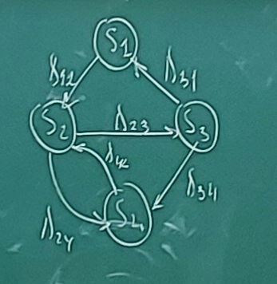
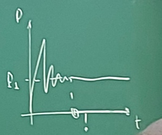

# Лекция 8 (24.10.2022)

https://studopedia.ru/21_22869_osnovnie-ponyatiya-teorii-massovogo-obsluzhivaniya.html

В i-м приборе обслуживания имеем два потока:

1) Поток заявок – интервал времени между моментами появления заявки на входе канала $k_i$
2) Поток обслуживания – интервал времени между началом и концом обсаживания заявки в канале.

Заявки, обслуженные каналом и заявки, покинувшие i-ый прибор не обслуженными, образуют выходной поток ($y_i$, т.е. интервалы времени между моментами выхода заявок).

Процесс функционирования i-ого прибора можно представить как процесс изменения его состояний во времени. Переход в новое состояние означает изменение количества заявок, которые могут находиться либо в накопителе либо в канале, следовательно вектор состояний для i-ого прибора имеет следующий вид:

$\overrightarrow{Z_i}=(Z_k^n, Z_i^k)$, где Z – заявка, L – емкость накопителя

$Z^n=L_i$

$Z^k=(0,1)$

Если 0, то накопитель пуст и если $z_i$ накопителя равно емкости i-ого накопителя, то накопитель полностью занят.

Если 0, то канал свободен, если 1 - канал занят.

В практике моделирования сложных систем, элементарные и сложные приборы обычно объединяются, при этом если каналы различных приборов обслуживания соединены параллельно, то имеет место многоканальное обслуживание. Если каналы соединены последовательно, то имеет место многофазное обслуживание. Поэтому для задания Q-схемы необходимо использовать оператор сопряжения, отражающий взаимосвязь элементов между собой.

Различают разомкнутые, замкнутые и смешанного типа Q-схемы. (В разомкнутых схемах выходной поток не может попасть на вход, а в замкнутых схемах количество заявок постоянно.)

Собственными внутренними параметрами Q-схемы будут являться:
- количество фаз;
- количество каналов в каждой фазе;
- количество накопителей в каждой фазе;
- емкость i-ого накопителя;
- еще ряд параметров...

Для задания Q-схемы также необходимо описание алгоритма функционирования Q-схемы, который (в данной интерпретации) определяет поведение заявок в системе в различных ситуациях.

Неоднородность заявок, отражающая реальный процесс учитывается введением классов приоритетов. Следовательно, Q-схема, описывающая процесс функционирования системы массового обслуживания любой сложности, можно задать в виде следующего кортежа:

$Q = (W, U, H, Z, R, A)$

1. W - подмножеством входных потоков
2. U - подмножеством потоков обслуживания
3. H - подмножеством собственных параметров
4. Z - множеством состояний элементов системы
5. R - оператором сопряжения элементов структуры (вектор сопряжения)
6. A - оператором алгоритмов обслуживания заявок (алгоритм)

Самостоятельно изучить блочно иерархический подход к моделированию Q-схем

Для получения соотношений, связывающих характеристики описания функционирования Q-схем, вводят некоторые допущения относительно входных потоков, функций распределения, функций плотности распределения, длительности обслуживания запросов, дисциплин обслуживания.

Для математического описания функционирования устройств, развивающегося в форме случайного процесса, может быть с успехом применен математический аппарат, разработанный в теории вероятности для так называемых Марковских случайных процессов.

Случайный процесс протекающий в некоторой системе S, называется *Марковским*, если он обладает следующим свойством: для каждого момента времени вероятность любого состояния системы в будущем зависит только от ее состояния в настоящем и не зависит от того, когда и каким образом система пришла в это состояние.

Вывод: нет Марковских систем.

Для Марковского процесса обычно составляются уравнения Колмогорова, представляющие следующие соотношения:
$F = (p'(t), p(t), \Lambda)=0$

для стационарного состояния системы:

$\Omicron = (p(t), \Lambda)=0$

$Y = Y(P(\Delta))$

$Y = Y(X, V, H)$

что дает нам возможность получить для стационарного потока, в данном случае, если время исключить $P = P(\Lambda)$

... зависимость выходных параметров от некоторых входных параметров системы и называется базисной моделью системы.

Следовательно нам нужно осуществить связь внутренних параметров модели: $\Lambda$ с конструктивными параметрами X, неуправляемыми параметрами V ну и учитывая по внутренним параметрам H. Таким образом мы должны получить зависимость:

$\Lambda = \Lambda(X, V, H)$

то-есть получаем интерфейсную модель.

Следовательно математическая модель системы строится как совокупность базисной модели и интерфейсной, что позволяет использовать одни и те же базисные модели для решения разных задач моделирования, осуществляя настройку на соответствующую задачу посредством изменения интерфейсной модели.

... должна обеспечивать временем вычисления реакции на запрос и производительность системы.

Пусть наша система S имеет 4 различимых состояния:

где имя стрелки $Sx$ – $Sy$ = $\Lambda_{xy}$

найдем вероятность P1, то есть вероятность того что в ... система будет находится в состоянии S1. Придадим времени T малое приращение времени Dt

https://studopedia.ru/21_22870_metodika-vivoda-uravneniy-kolmogorova.html

Найдем вероятность ($P_1$) того, что в момент времени t система находится в состоянии S1. Придадим t, малое приращение $\Delta t$ и определим, что система в момент времени $t+\Delta t$ находится в состоянии S1.

Это можно найти двумя способами:
1) В момент t, система S была в состоянии $S_1$ и за $\Delta t$ не вышла из него
2) В момент t, системы S была в состоянии $S_3$ и за $\Delta t$ пришла в S1

Вероятность первого способа как произведение вероятностей $P_1(t)$ на условную вероятность того, что будучи в состоянии $S_1$ система не перейдет в состояние S2.

Таким образом мы получаем первое уравнение Колмогорова:

$P_1(t+\Delta t) = P_1(t)(1-\lambda_{12}\Delta t)+P_3(t)\Lambda_{31}\Delta t$

$\lim\limits_{\Delta t\to 0}{\frac{P_1(t+\Delta t)-P_1(t)}{\Delta t} = -P_1(t)\lambda_{12}+P_3(t)\lambda}$

$P'_1(t) = -P_1(t)\lambda_{12}+P_3(t)\lambda$

2. Найдем вероятность того, что система находится в состоянии S2:

$P_2(t+\Delta t) = P_2(t)(1-\lambda_{24} \Delta t - \lambda_{23} \Delta t) + P_1(t) \lambda_{12} \Delta t + P_4(t) \lambda_{42} \Delta t$

$\lim\limits_{\Delta t\to 0}{\frac{P_2(t+\Delta t)-P_2(t)}{\Delta t} = -P_2(t) \lambda_{24}-P_2(t) \lambda_{23} + P_1(t) \lambda_{12} + P_4(t) \lambda_{42}}$

$P'_2(t) = -P_2(t)\lambda_{24} - P_2(t)\lambda_{23} + P_1(t)\lambda_{12} + P_4(t)\lambda_{42}$

3. Найдем вероятность того, что система находится в состоянии S3:

$P'_3(t) = -P_3(t)\lambda_{31} - P_3(t)\lambda_{34} + P_2(t)\lambda_{23}$

4. Найдем вероятность того, что система находится в состоянии S4:

$P'_4(t) = -P_4(t)\lambda_{42} - P_2(t)\lambda_{24} + P_3(t)\lambda_{34}$

В результате получаем систему уравнений Колмогорова:

$
\begin{cases}
P'_1(t) = -P_1(t)\lambda_{12}+P_3(t)\lambda \\
P'_2(t) = -P_2(t)\lambda_{24} - P_2(t)\lambda_{23} + P_1(t)\lambda_{12} + P_4(t)\lambda_{42} \\
P'_3(t) = -P_3(t)\lambda_{31} - P_3(t)\lambda_{34} + P_2(t)\lambda_{23} \\
P'_4(t) = -P_4(t)\lambda_{42} - P_2(t)\lambda_{24} + P_3(t)\lambda_{34} 
\end{cases}
$

Именно эти уравнения, называются уравнениям Колмогорова.

Интегрирование данной системы дает искомые вероятности состояний, как функций от времени. Начальные условия берутся в зависимости от того, какого было начальное состояние системы. 

Уравнения Колмогорова строится по следующему правилу:
1) В левой части каждого уравнения стоит производная вероятности состояния, а в правая часть содержит столько членов, сколько стрелок связано с этим состоянием.
2) Если стрелка направлена «из» состояния, соответствующий член имеет знак “-“, если «в» состояние, то знак “+”.
3) Каждый член равен произведению плотности вероятности перехода (интенсивность), соответствующий данной стрелке, умноженной на вероятность того состояния, из которого выходит стрелка.

## Задание на ЛР 2 
Необходимо определить ВРЕМЯ пребывания системы в каждом состоянии в установившимся режиме работы системы массового обслуживания.

В качестве исходных данных создаем интуитивно понятное меню (задать количество состояний системы, максимум 10). Ввожу 5, появляется матрица размерностью 5x5 на пересечении строк и столбцов находятся интенсивности переходов состояний. Матрицу можно заполнить. Нажимаем кнопку Пуск и появляется две строки:
1) вероятность пребывания
2) время пребывания в состоянии

для каждого состояния

Вот это время:

Сумма вероятностей не больше единицы, а время как посчитаете