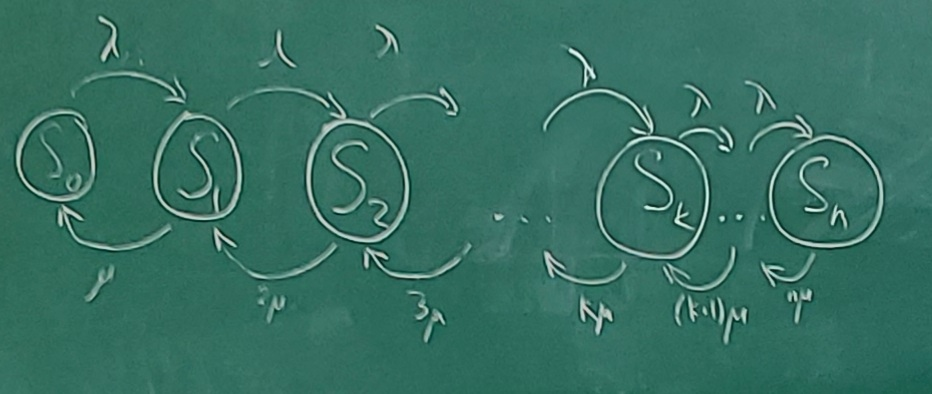
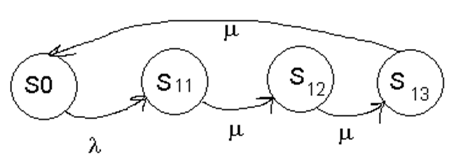

# Лекция 9 (31.10.2022)
## Многоканальная система обслуживания с отказами

Будем нумеровать состояния системы по числу занятых каналов, тоесть по числу заявок в ... системе.

https://studopedia.ru/21_22870_metodika-vivoda-uravneniy-kolmogorova.html

$S_0$ - все каналы будут свободны

$S_1$ – занят один канал, остальные свободны

$S_k$ – занято k каналов, остальные свободны

$S_n$ – заняты все n каналов.

Разметив граф, расставим стрелки интенсивностей соответствующих потоков. По стрелкам слева направо системы переводит один и тот же поток, это поток заявок с интенсивностью $\lambda$. Пусть система была в состоянии $S_1$ и тогда как только закончится обслуживание заявки занимающего этот канал, система перейдет в состояние $S_0$. Если обслуживающим ... занято два канала, а не один... Если у нас было k каналов

Разметим граф, т.е. проставим у стрелок интенсивности соответствующих потоков событий. Пусть система находится в состоянии $S_1$. Как только закончится обслуживание заявки, занимающей этот канал, система переходит в состояние $S_0$, интенсивность перехода m. Если занято 2 канала, а не один, то интенсивность перехода составит $2\mu$.

Уравнения Колмогорова:
$
\begin{cases}
p'_0(t) = -p_0\lambda + p_1\mu \\
p'_1(t) = -p_1\lambda - p_1\mu + p_0\lambda + p_2\mu \\
p'_2(t) = -p_2\lambda - p_2 2\mu + p_1\lambda + p_3 3\mu \\
p'_k(t) = -p_k\lambda - p_kk\mu + p_{k-1}\lambda + p_{k-1}(k+1)\mu \\
p'_n(t) = p_{n-1}\lambda - p_n n \mu
\end{cases}
$

Предельные вероятности состояний p0 и pn характеризую установившийся режим работы системы массового обслуживания при $t\to\infin$.

$\Large p_0=\frac{1}{1+\frac{\lambda/\mu}{1!}+\frac{(\lambda/\mu)^2}{2!}+...+\frac{(\lambda/\mu)^n}{n!}}$

$\Large p_k= \frac{(\lambda/\mu)^k}{k!}p_0$

$\lambda/\mu$ - среднее число заявок, приходящих в систему за среднее время обслуживания одной заявки.

$\large p_0=[1+\frac{\rho}{1!}+\frac{\rho^2}{2!}+\frac{\rho^2}{2!}]$

$\large p_k=\frac{p^k}{k!}p_0$

Зная все вероятности состояний $p_0 , … , p_n$ , можно найти характеристики СМО:

* вероятность отказа – вероятность того, что все n каналов заняты 
$\\ \large p_{1OE}=p_n=\frac{\rho^n}{n!}p^0$
* относительная пропускная способность – вероятность того, что заявка будет принята к обслуживанию
$\\ \large q=1-p_n$
* среднее число заявок, обслуженных в единицу времени
$\\ \large A=\lambda q$

Полученные выражения могут рассматриваться как базисная модель оценки характеристик производительности системы. Входящий в эту модель параметр $\lambda$ ... и является усредненной характеристикой пользователей, а параметр \mu это функция технических характеристик компьютера, не только их, но еще и решаемых задач. Связь между ними должна быть установлена с помощью интерфейсной модели.

В простейшем случае, когда время ввода/вывода информации у каждой задачи мало по сравнению со временем ее решения, то можно принять что время решения ровно $1/\mu$, где время решение это среднее время решения задачи процессом [сек] И оно ровно дроби, в числителе которой будет среднее число операция выполняемых процессором на одну задачу. 

## [Немарковские случайные процессы, сводящиеся к Марковским](https://studfile.net/preview/725120/page:11/)
Реальные процессы весьма часто обладают последействием и поэтому не являются Марковским. Иногда (очень редко) при исследовании таких процессов удается воспользоваться методами, разработанными для Марковских цепей. Наиболее распространенными являются:
1. Метод разложения случайного процесса на фазы (метод псевдо состояний)
2. Метод вложенных цепей Маркова

### Метод псевдо состояний.
Сущность метода заключается в том, что состояние системы, потоки переходов из которых являются немарковскими, заменяются эквивалентной группой фиктивных состояний, потоки переходов, из которых являются Марковскими.

Условие статистической эквивалентности реального состояния и фиктивных в каждом конкретном случае подбираются индивидуально. Очень часто может использоваться следующее: $min \int_{t_1}^{t_2}{()\lambda_{экв}(\tau)-\lambda_i(\tau)dt}$, где $\lambda$- эквивалентная интенсивность перехода в i-ой группе переходов, заменяющей реальный переход, обладающий интенсивностью $\lambda_i$.

За счет расширения числа состояний системы некоторые процессы удается точно свести к Марковским. Созданная таким образом система статистически эквивалентна или будет близка к реальной системе, и она подвергается обычному исследованию с помощью аппарата Марковских цепей. 

К числу процессов, которые введением фиктивных состояний можно точно свести к Марковских относятся процессы под воздействием потоков Эрланга. В случае потока Эрланга k-ого порядка интервал времени между соседними событиями представляет собой сумму k независимых случайных интервалов, распределенных по показательному закону. Поэтому с введением потока Эрланга k-го порядка к Пуассоновскому осуществляется введением k псевдо состояний. Интенсивности переходов между псевдо состояниями равны соответствующему параметру потока Эрланга. Полученный таким образом эквивалентный случайный процесс является Марковским, т.к. интервалы времени нахождения его в различных состояниях подчиняются показательному закону.

Пример. Устройство S выходит из строя с интенсивностью $\lambda$, причем поток отказов Пуассоновский. После отказа устройство восстанавливается и время восстановления распределено по закону Эрланга 3 порядка с функцией плотности $f_2(t)=0.5\mu(\mu t)^2 e^(-\mu t)$.

Система может принимать два возможных состояния:

$S_0$ - устройство исправно;

$S_1$ - устройство отказало и восстанавливается

Переход из $S_0$ в $S_1$ осуществляется под воздействием пуассоновского потока, а обратный - потока Эрланга.

Представим случайное время восстановления в виде суммы 3х случайных временных интервалов, распределенных по показательному закону с интенсивностью $\mu$.

$
\begin{cases}
p'_0 = 0 = -\lambda p_0 + \mu p_{13} \\
p'_{11} = 0 = -\lambda p_{11} + \mu p_{0} \\
p'_{12} = 0 = -\lambda p_{12} + \mu p_{11} \\
p'_{13} = 0 = -\lambda p_{13} + \mu p_{12} \\
p_0 + p_1 = 1 \\
p_1 = p_{11} + p_{12} + p_{13}
\end{cases}
$

$\large p_{13}=\frac{\lambda}{\mu}p_0$

$\large p_{11}=\frac{\lambda}{\mu}p_0$

$\large p_{12}=\frac{\lambda}{\mu}p_0$

$\large p_1=\frac{3\lambda}{\mu}p_0$

$\large p_0 + \frac{3 \lambda}{\mu}p_0 = 1 => p_0 = \frac{\mu}{\mu+3\lambda}$

$\large p_1=\frac{3\lambda}{\mu+3\lambda}$

Ответ: $\large P_0=\frac{\mu}{\mu+3\lambda}, P_1 = \frac{3}{3+\frac{\mu}{\lambda}}$

### Метод вложенных цепей Маркова.
Вложенные цепи Маркова образуются следующим образом. В исходном случайном процессе выбираются такие случайные процессы, в которых характеристики образуют Марковскую цепь. Моменты времени обычно являются случайными и зависят от свойств исходного процесса. Затем обычными методами теории Марковских цепей исследуются процессы только в эти характерные моменты. Случайный процесс называется полумарковским(с конечным или счетным множеством состояний) если заданы переходы состояний из одного состояния в другое и распределение времени пребывания процессов в каждом состоянии. Например, в виде функции распределения или функции плотности распределения.

<остальное самостоятельно>

### Метод статистических испытаний. Метод Монте-Карло.
Преимущество метода статистических испытаний: его универсальность, обуславливающая его возможность всестороннего статистического исследования объекта. Но для реализации этого исследования необходимы довольно полные статистические сведения о параметрах элемента входящих в системы.

 Недостаток:

Большой объем требующихся вычислений, равный количеству обращений к модели. Поэтому вопрос выбора величины n имеет важнейшее значение. Уменьшая n– повышаем экономичность расчетов, но одновременно ухудшаем их точность.

Вопрос выбора величины n имеет важнейшее значение. Уменьшение количества испытаний повышает экономичность расчетов, но ухудшает их точность.