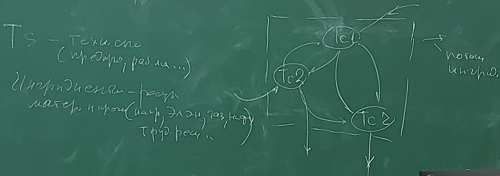
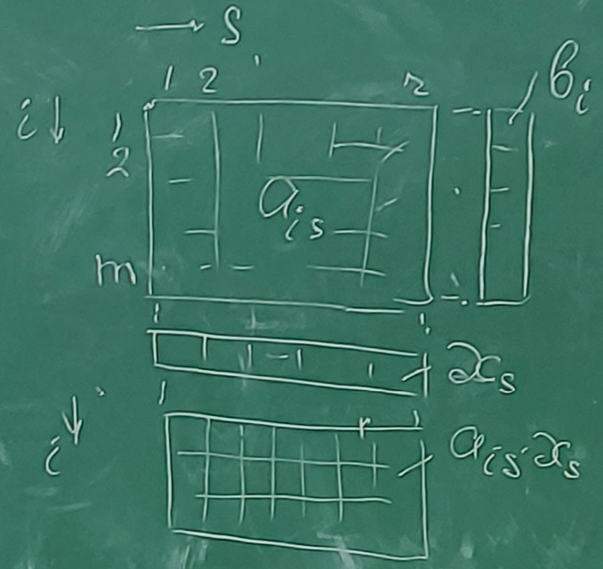

# Основная плановая производственная задача Канторовича. Открытая (к домашнему заданию)
> На следующее занатие принести ноутбуки с excel.

ТС - технологический способ (предприятие, рабочее место и т.д.)

Ингридиенты - ресурсы материальные и прочие (электроэнергия, газ, нефть, трудовые ресурсы и т.д.)

    

$i$ - индекс ингридиента, $i =1,2,...,r$

$s$ - индекс Тс, $s = 1,2,...,m$

$a_{is}$ - норма участка i-го инг. в s-м Тс

$b_i$ - ограничение на обмен со средой по i-му ингрид.

$x_s$ - интенсивность функ. s-го Тс

$p_s$ - коэфициент эффек. s-го Тс

---------------------------------
$a_{is}$, $b_i$ - действ. чис. $(<,>,0)$

$x_s>=0$

В столбце могут быть положительные, отрицательные или 0. Столбец соответствует каком-то Тс. Если положительное число, то значит что данный ингридиент создается в данном Тс. Если отрицательное число, значит потребляется. Если ноль (пусто), значит данный ингридиент в s-m Тс не участвует.

Фактическое потребление и создание ресурсов ингридентов в данном Тс пропорционально $x_s$.

В табличке $a_{is} * x_s$ - количество создаваемых потребляемых ингридентов при данном  $x_s$ (интенсивности).

<u>**Задача:**</u> 

Найти $x_s$ для всех $s$ ($s=1,2,...,r$), так чтобы некий критерий оптимальности зависящий от $x_s$ был наилучшим ($\sum a_{is}*x_s > b_i, i=1,2,...,m$) при $\sum a_{is}*x_s > b_i, i=1,2,...,m$

Так чтобы,

$\sum p_s*x_s \to max$

$\sum a_{is}*x_s > b_i, i=1,2,...,m$ , где
$\sum a_{is}*x_s$ - баланс i-го ингридиента

Это задача линейного программирования. Такая задача может иметь решение.

Оптимальное решение - такое, что все другие не лучше.

> Дома подумать о единицах измерения (на досуге). Для того чтобы разобраться с единицами измерения нужно написать формулу.

В централизованной экономике часто применяется другая модель - иодель межотреслевого баланса Леонтьеова (так называемые Леонтьевские матрицы)

Отличие от задачи Конторович: один ингридиент - один технологический способ, поэтому Тс понимаются как отрасли. То есть каждая отрсаль производит свой ингридиент. И тогда здесь система линейных уравнений (матричный способ решения).