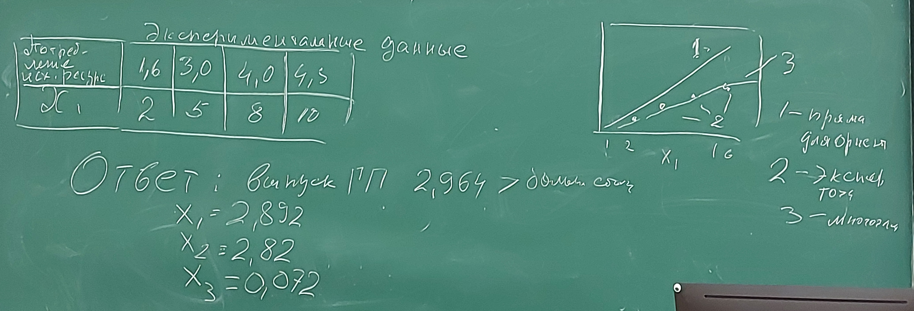

# Семинар 7
## РК 2 Нелинейная задача Канторовича

Эксперементальные данные:
| Потребление исходных ресурсов | 1,6 | 3,0 | 4,0 | 4,5 |
|-------------------------------|-----|-----|-----|-----|
| Потребление исходных ресурсов |  2  |  5  |  8  | 10  |

Ответ: Выпуск ГП 2,964 >  больше старого \
        $x_1=2,892$ \
        $x_2=2,82$ \
        $x_3=0,072$

## Задание на РК 2
Решить нелинейную задачу Канторовича, разработав математическую модель потребления исходного ресурса в зависимости от интенсивности функционирования производителя полуфабрикатов $x_1$.
Вид модели - многочлен 4ой степени, коэффициенты многочлена $c_1*x_1+c_2*x_1^2 + ... + c_4*x_1^4$ определить на основании заданной экспериментальной зависимости, методом минимизации суммы квадратов отклонений математической модели от экспериментальных данных применяя поиск решения.
Искомые независимые величины -- коэффициенты многочлена (c1, c2, ...).
Изобразить диаграмму (см. рисунок).

Рекомендации: на excel листе справа от решения задачи Канторовича сделать четыре строки:
1. $x_1$ меняется от 0 до 10 с единичным шагом.
2. Экспериментальные данные - четыре точки.
3. Математическая модель в виде многочлена.
4. Линия для визуального контроля

Удобно сделать столбец из 4-ех ячеек, где $c_1$, $c_2$, $c_3$, и $c_4$.

Критерий оптимальности - сумма квадратов отклонений (отдельная ячейка).

Тип графиков - графики с маркерами.

